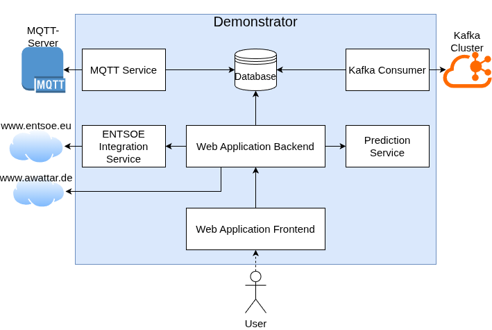

# EDDIE Demonstrator





## Demonstrator Core

This is the core of the EDDIE Demonstrator. It consists of these main components:
- **Kafka Consumer:** A Consumer that listens to Kafka messages that contain energie consumption data, then processes and persists them.
- **MQTT Service:** A service for listening to real-time data from MQTT topics, also processing and writing to the database.
- **Django Web Application:** A web application that serves as the frontend for visualizing energie data. This data is fetched from the backend, which loads
it from the database.
- **Database:** A PostgreSQL database for storing all the data. This is used by the Kafka Consumer, MQTT Service, and Django Web Application.

This application is designed to be modular, with each component having its own responsibilities. The Kafka Consumer and MQTT Service are responsible for data ingestion, 
while the Django Web Application is responsible for data visualization. 
The database serves as the central repository for all data, allowing for easy access and management.

The web application is further divided into these apps:
- **Authenctication:** Handles user authentication and authorization.
- **Awattar:** Handles fetching and processing of data from the Awattar API, providing insights into current energie market price data.
- **Consumption:** Handles fetching and processing of consumption data from the database.
- **Demonstrator:** The core app with all external endpoints and views for the frontend.
- **Entsoe:** Handles fetching and processing of data from the external ENTSOE Integration Service, providing insights into emission data.
- **Predictions:** Handles fetching and processing of prediction data from the external Prediciton Service, providing insights into predicted future consumption.
- **Templates:** Where the HTML templates for the frontend are stored. These are used by the views in the Demonstrator app to render the frontend pages.

## Deployment
This application is designed to be deployed using Docker. For this, there is a `Dockerfile` and a `docker-compose.yml` file included in the demonstrator_core directory. 
The `Dockerfile` is used to build the Docker image for the application, while the `docker-compose.yml` file is used to define and run the multi-container Docker application, including the database and any other necessary services.
To deploy the application, you can use the following commands in the demonstrator_core directory:
```bash
docker compose up -d
```
This will build the Docker image and start the application.
It is necessary to have a .env file with the necessary environment variables for the application to run properly.
For local development, you can use the provided `docker-compose-local.yml` file, which includes paths to the ENTSOE and Prediction services on the local machine. You can start the local development environment with the following command:
```bash
docker compose -f docker-compose-local.yml up -d
```