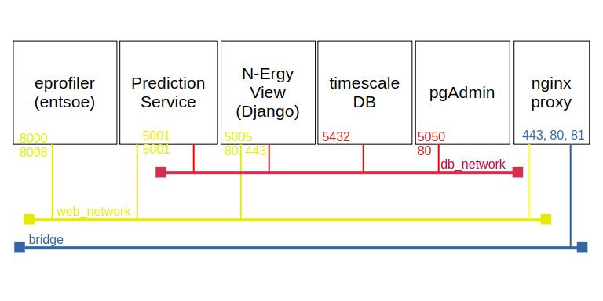
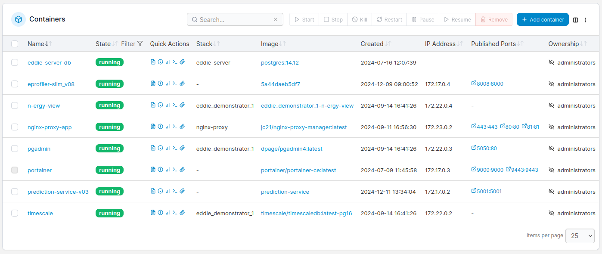

# Server Runtime Environment

## Container Layout


## Host  Machine (VM)

**Virtual machine:**
- OS: Debian 12
- network access: eddie.cosylab.at (ports 22, 80 and 443 exposed to public internet)
- port mapping via reverse proxy inside docker

**HOME directory**:  ```/opt/eddie```
- ```/opt/eddie/deployments```: utilities and docker volumes for deployment
- ```/opt/eddie/repositories```: for manual docker deployment via git pull

## Container Runtime (Docker)

- docker images and containers, see figure above
- docker containers composition: networks and ports, see figure above
- Portainer (see: https://www.portainer.io) for docker management
- reverse proxy for network traffic routing: Nginx Proxy Manager (see: https://nginxproxymanager.com)
- certificate management via lets encrypt (see: https://letsencrypt.org) to serve https
- network configuration and port mapping, see figure above
- volume mapping to ```/opt/eddie/deployments/data```


Example script to set up SSL tunneling:

```bash
#!/bin/bash
SERVER=eddie.cosylab.at

USER=joachimz

# local ports
P81=2081   # Nginx
P9000=2900 # portainer
P5050=2550 # pgAdmin
P5432=2432 # postgres
P5431=2431 # timescaledb
P8008=2808 # eprofiler

echo "connection to $USER@$SERVER"

ssh -L $P81:$SERVER:81 \
    -L $P5050:$SERVER:5050 \
    -L $P8008:$SERVER:8008 \
    -L $P5432:$SERVER:5432 \
    -L $P5431:$SERVER:5431 \
    -L $P9000:$SERVER:9000 \
    $USER@$SERVER
```

## Portainer Snapshot

